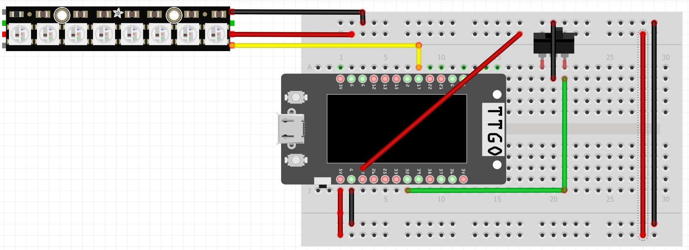

# MTA Smart Table Lamp 🚊🏮
## 🚀 About
Make your own MTA Table Lamp for much cheaper and adjustable whitebalance based on the sun using an ESP32!

    
    

## ⚙️ Hardware
### 🖨️ 3D Models (CAD stl files)
- The following thingiverse contains 3 STL files.
    - ``mta-base-lid.stl`` can be printed with 15-30% infill. 
        - You could fill it with sand or metal BBs for weight. 
	- ``mta-base.stl`` can be printed with 15-30% infill. 
        - This is where you will double side tape onto the central tower.
	- ``mta-lamp-shade.stl`` is where you will print in slow/delicate setting. You should set the wall thickness layer between 2-4.

### 🪛 Hardwares involved
- Neopixel hw160 or any rgb strip (but may require different transistors)
- ESP32 (using Lilygo ESP32 TTGO in this case)
- Breadboard
- Male-to-male header cables
- Button/SDPT switch

### ᯤ Circuit diagram
- Referring to the ``rgb_led_circuit.fzz`` or the following screenshot, route the hardware as shown above.

## 🖥️ Software
### 📝 Instructions
- Lamp will change white balance based on the nautical twilights, civil twilights, sunrise/sunset, and solar noon. 
- Switch will turn the lamp on and off.

### 📋 Instructions to run arduino code
1) Using the [Arduino IDE](https://www.arduino.cc/en/software), open the respective ``.ino`` file
2) Install [TTGO T-display driver](https://github.com/Xinyuan-LilyGO/TTGO-T-Display)
3) Assign Arduino IDE port to the one that Lilygo TTGO is connected to
4) Install TFT_eSPI library (display library)
	- Under Arduino IDE/tools/library_manager, search ``tft_espi``
	- Navigate to the library, e.g. Documents/Arduino/libraries/tft_espi
	- Open up the file Arduino/libraries/TFT_eSPI/User_Setup_Select.h
	- comment out the line ``#include <User_setup.h>``
	- uncomment out the line include ``<User_Setups/Setup25_TTGO_T_Display.h>>``
	- note - commenting out means adding ``//`` in front of the line, to uncomment, remove ``//`` but don’t remove the ``#`` sign
5) Install [Adafruit Neopixel](https://github.com/adafruit/Adafruit_NeoPixel) under ``Arduino IDE/Library Manager``
6) Install [SPI](https://docs.arduino.cc/language-reference/en/functions/communication/SPI/) under ``Arduino IDE/Library Manager``
7) Go to ``sunrise-sunset-n-current-time.ino`` and change the wifi name and password to your own wifi name and password.
8) Compile and upload the code from the ``.ino`` to your Lilygo TTGO
9) Money 💸💸💸
